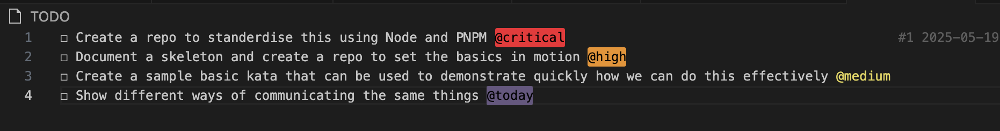

# Most efficient way to start a Node kata

[TOC]

Help do node Katas with minimul effort, lots of centralised documents on katas and the latest recomendations. Here is a set of recommendations.

- Fork this and then you just need to branch and code away or allow me to set you up to contribute and simply create a branch to contribute on

  

- Setup with node latest, installing `pnpm` with with Jest and a basic sample to run, NVM and install 'pnpm'

- When you hit the refactoring phase, check code for [code smells](https://refactoring.guru/refactoring/smells)

- Create a _folder_ with **README.md** and keep your changes short and sweet

- Make sure you use a timer https://cuckoo.team/ to ping pong between you and remember to optimise your energy and attention span

- Make sure the code formatter and dev environment is working consistently before starting as this will just spoil the flow if it is not setup in a ping pong kinda way

- Make sure as you as developing that follow [Beck's design](https://martinfowler.com/bliki/BeckDesignRules.html) rules:

  - Passes the **tests**
  - Reveals **intention**
  - No **duplication**
  - **Fewest elements** - KISS

- **Communication and respect** is your most effective life skill

- **Environment** has only `pnpm test` to riun once and `pnpm watch` to keep it running as you kata away

  ```shell
  # Test to check environment is working for all parties and a quick way of getting into things
   PASS  sum/sum.should.test.ts
    sum should
      ✓ sum two numbers (2 ms)
      ✓ sum two numbers with negative
      ✓ sum two numbers with zero
      ✓ sum two numbers with decimal
      ✓ sum [1, 2] to equal 3 (1 ms)
      ✓ sum [-1, -2] to equal -3
      ✓ sum [0, 0] to equal 0
      ✓ sum [1.5, 2.5] to equal 4
      ✓ sum [1, 2, 3] to equal 6
      ✓ sum [1, 2, 3, 4, 5] to equal 15
      ✓ sum [-1, -2, -3, -4, -5] to equal -15
      ✓ sum [-1, 2, -3, 4, -5] to equal -3

  Test Suites: 1 passed, 1 total
  Tests:       12 passed, 12 total
  Snapshots:   0 total
  Time:        0.864 s
  Ran all test suites.

  Watch Usage
   › Press f to run only failed tests.
   › Press o to only run tests related to changed files.
   › Press p to filter by a filename regex pattern.
   › Press t to filter by a test name regex pattern.
   › Press q to quit watch mode.
   › Press Enter to trigger a test run.
  ```

- There should be a vscode for setting vscode with prettier, add extension

- This is how I set this up this project ready for you to hit the ground running

  - `pnpm` is fast and disk-efficient

  - What do I need to get it working?

    - Install the latest node using nvm

    - Install via `corepack` (Recommended for Node.js ≥16.13)

      ```bash
      ❯ corepack enable
      ❯ corepack prepare pnpm@latest --activate
      Preparing pnpm@latest for immediate activation...
      ❯ pnpm --version
      10.10.0
      ❯ node --v
      node: bad option: --v
      ❯ node -v
      v22.14.0
      ```

    - Initialise a new project using `pnpm`:

      ```bash
      mkdir test-pnpm && cd test-pnpm
      pnpm init
      ```

    - Install dev dependencies

      ```bash
      # Install jest and tyescript as this will always be my base from here on
      pnpm add -D jest ts-jest @types/jest typescript
      ```

    - Initialise the `ts-jest` config:

      ```
      ❯ npx ts-jest config:init
      ❯ pnpm add -D jest @types/jest
      ❯ npx jest --init
      ```

    - Create the sum kata to setup the environment ready to start:

      ```bash
      ❯ pnpm test
      ❯ pnpm watch
       PASS  sum/sum.test.ts
        sum
          ✓ should sum two numbers (1 ms)
          ✓ should sum two numbers with negative
          ✓ should sum two numbers with zero
          ✓ should sum two numbers with decimal

      Test Suites: 1 passed, 1 total
      Tests:       4 passed, 4 total
      Snapshots:   0 total
      Time:        0.554 s
      Ran all test suites.

      Watch Usage: Press w to show more.
      ```

    - Install ESLint and Prettier:

      ```bash
      ❯ pnpm add -D eslint prettier
      ```

    - Initialise ESLint for TypeScript:

      ```bash
      ❯ pnpx eslint --init
      ```

    - Add Prettier Compatibility:

      ```bash
      ❯ pnpm add -D eslint-config-prettier eslint-plugin-prettier
      ```

    - Format Prettier on save via vscode settings for the moment:

      ```json
      {
        "editor.defaultFormatter": "esbenp.prettier-vscode",
        "editor.formatOnSave": true
      }
      ```

## 🧑‍💻 Pair Programming Etiquette: Seven Principles

Effective pair programming enhances collaboration, knowledge sharing, and code quality. Adhering to these principles ensures productive and respectful sessions:

1. **Optimise the Environment**
   Ensure both developers are comfortable with the hardware setup. Accommodate individual IDE preferences to facilitate smooth collaboration.
2. **Prepare the Software**
   Configure the development environment, tools, and dependencies beforehand to minimise disruptions during the session.
3. **Embrace Skill Diversity**
   Pairing individuals with varying experience levels fosters mutual learning. Both the driver and the observer can gain valuable insights from each other.
4. **Maintain Focus**
   Concentrate on the task at hand. Break down large tasks into manageable segments to tackle them sequentially.
5. **Take Regular Breaks**
   Incorporate short breaks to prevent fatigue and maintain high levels of concentration and productivity.
6. **Rotate Pairings**
   Regularly switch pairing partners to disseminate knowledge across the team and prevent information silos.
7. **Respect Your Partner**
   Communicate openly about schedules and changes. Pay attention to small details that can impact your partner's comfort and workflow.

## 🧩 Communication & Conway's Law

**Conway’s Law** states:

> _“Any organisation that designs a system will produce a design whose structure is a copy of the organisation’s communication structure.”_ — Melvin Conway, 1967

### 🧠 Why Communication Matters

Communication isn’t just a team dynamic—it’s a **determinant of software architecture**. According to Conway’s Law, how teams communicate (or fail to) is directly reflected in how systems are designed and built.

### 🔄 Key Implications

- **Team boundaries shape system boundaries**: If teams are siloed, systems are likely to exhibit integration boundaries or coupling problems at the same seams.
- **Cross-team collaboration drives cohesion**: When teams collaborate effectively, the resulting architecture is more modular and consistent.
- **Communication paths influence modularity**: Strong communication within teams tends to foster coherent, well-encapsulated components.

### 🛠 Architectural Relevance

- When designing a system, **organisational structure should be intentional**. Aligning team structure to desired architecture—an approach known as **“inverse Conway manoeuvre”**—helps achieve scalable, maintainable solutions.
- Practices like **Domain-Driven Design (DDD)** and **Team Topologies** leverage this principle to ensure that software mirrors the most effective communication patterns.

## 🧭 The CORE Feedback Method (Radical Candor)

The CORE model offers a structured approach to delivering feedback that is both kind and clear, ensuring it is actionable and fosters trust. It complements the Radical Candor framework, which emphasises **Caring Personally** while **Challenging Directly**.([Radical Candor](https://www.radicalcandor.com/blog/fast-and-meangingful-feedback/?utm_source=chatgpt.com), [Radical Candor](https://www.radicalcandor.com/our-approach/?utm_source=chatgpt.com))

### 🔹 C — Context

Specify the situation to ground the feedback.
_Example_: "During yesterday's team meeting..."

### 🔹 O — Observation

Describe the specific behaviour observed, avoiding interpretations or judgments.
_Example_: "You interrupted the client before they finished explaining their concern."

### 🔹 R — Result

Explain the impact of the behaviour on the team, project, or individual.
_Example_: "This led to confusion about our proposed solution."

### 🔹 E — nExt stEps

Suggest actionable steps or invite collaboration on solutions.
_Example_: "In future meetings, let's ensure we allow clients to fully express their points before responding."([Radical Candor](https://www.radicalcandor.com/blog/care-personally-team))

By adhering to the CORE method, feedback becomes more structured and effective, promoting a culture of open communication and continuous improvement.

---

For a deeper understanding, refer to the original article: [How To Give Candid Feedback With the Radical Candor CORE Method](https://www.radicalcandor.com/blog/how-to-give-feedback/).([Radical Candor](https://www.radicalcandor.com/blog/how-to-give-feedback/?utm_source=chatgpt.com))

Here's a concise summary of your VS Code TODO utility list, suitable for a README or project planning document:

---

## 📋 TODO Utility Summary

This utility outlines the plan to standardise and streamline kata-based development using Node.js and PNPM, with a focus on effective communication and rapid onboarding.

### 🛠 Tasks Overview

| Priority    | Task                                                                                  |
| ----------- | ------------------------------------------------------------------------------------- |
| 🔴 Critical | Create a repo to standardise the approach using **Node.js** and **PNPM**              |
| 🟠 High     | Document a project skeleton and initialise a repo to establish foundational practices |
| 🟡 Medium   | Develop a basic kata to serve as a quick-start demonstration of the methodology       |
| 🟢 Today    | Explore and present multiple ways of communicating the same concepts effectively      |

### 🎯 Goal

To create a reusable, well-documented kata framework that supports clean coding practices, consistency across projects, and strong communication patterns for technical concepts.

```
☐ Create a repo to standerdise this using Node and PNPM @critical
☐ Document a skeleton and create a repo to set the basics in motion @high
☐ Create a sample basic kata that can be used to demonstrate quickly how we can do this effectively @medium
☐ Show different ways of communicating the same things @today
```



# 📌 Summary

Clear and deliberate communication isn’t ancillary to architecture—it’s foundational. Recognising the impact of organisational structure on technical structure helps avoid accidental complexity and encourages intentional system design. Checkout the [Pull request](https://github.com/vfarah-if/NodeTestKit/pull/1/commits) example on a simple add kata for a basic take on this.
